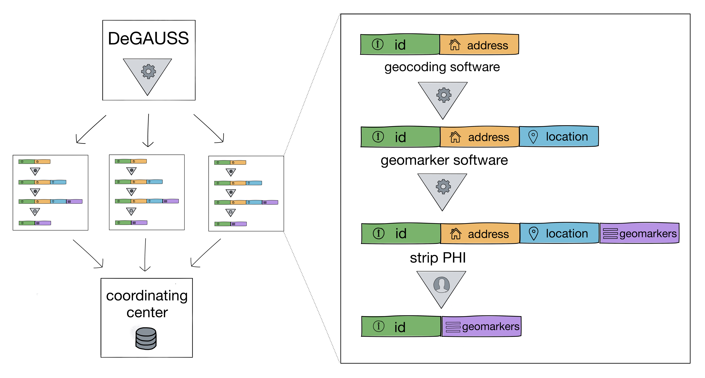

# Summary

Scientific studies often examine the relationships between place-based information and health outcomes; for example, air pollution and asthma, neighborhood crime and mental health, or community greenspace and IQ. Study subjects with location information, most commonly a residential mailing address, are linked to databases of place-based information, or "geomarkers" in order to conduct these studies. Defined formally, a "geomarker" is any objective, contextual or geographic measure that influences or predicts the incidence of outcome or disease. "Geocoding" is the process of translating a string of text referring to a location (most often a mailing address) into coordinates on the earth's surface (most often latitude and longitude). These coordinates are required to link participants to their estimated exposures to geomarkers -- a process we call "geomarker assessment". Some examples of geomarker assessment commonly performed in health studies using people include distance to the nearest major roaday -- a commonly used as a measure of estimated exposure to traffic related air pollution that is associated with increased risk of asthma -- or  neighborhood median household income -- a commonly used as a measure of community deprivation associated with increased bed days spent in the hospital.

Studies that utilize geocoding and assessment of any geomarkers frequently utilize residential addresses or other geolocation data that are considered protected health information (PHI). The HIPAA privacy rule [@hipaa], the HITECH Act of 2009 [@hitech], and the Federal Policy for the Protection of Human Subjects [@commonrule] establish regulations to safeguard the confidentiality of patients and research subjects when health care providers or researchers use PHI. While beneficial with repsect to privacy, this prevents an outstanding challenge for researchers by preventing them from using external third party software to analyze and extract information from study participants' adddresses or locations. Furthermore, this restricts scientists' ability to collaborate by combining datasets containing any PHI. We are critically missing standard ways to make this easy.

`DeGAUSS` is a standalone, container-based application that can produce geocodes and derive community and environmental exposures. Usable on PC, Mac, or Linux machines, identifying information never leaves the local machine. Figure 1 illustrates the process of using `DeGAUSS` within a multi-site study. Each study site uses `DeGAUSS` to both independently geocode their own addresses and link in the necessary place-based characteristics. After any PHI is removed, the data including the geomarkers are no longer considered PHI and are available for sharing and collaboration. In addition to securing PHI, this guarantees that the software will always run the same, regardless of its environment, which is a vital requirement for reproducible research. 

`DeGAUSS` relies heavily on `R` [@R] and the geospatial packages `sp` [@bivand2005classes], `rgdal` [@rgdal] `tigris` [@tigris], and `tidycensus` [@tidycensus]. The underlying geocoder is based on the `usaddress` geocoder [@cole_brokamp_2017_344621]. It was designed to be used by scientific researchers who wish to collect place-based data on study subjects and patients with a residential address. A proof of concept of the application of `DeGAUSS` within a multi-site study has previously been described [@degaussjamia] and this approach is currently being adopted by several other multi-site cohort studies. Additionally, `DeGAUSS` has found use within the electronic health records of healthcare systems to automate geocoding and assessment of community characteristics and environmental exposures.

`DeGAUSS` is currently licensed under GNU GPLv3, archived on Zenodo with a linked DOI [@cole_brokamp_2017_570873], and is maintained on GitHub (https://github.com/cole-brokamp/DeGAUSS) where users can submit issues and propose their own extensions and additions.

# References
